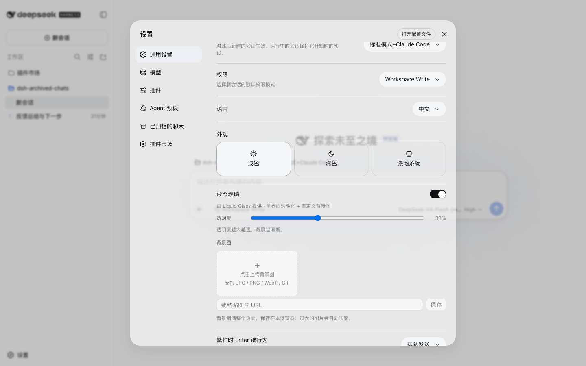
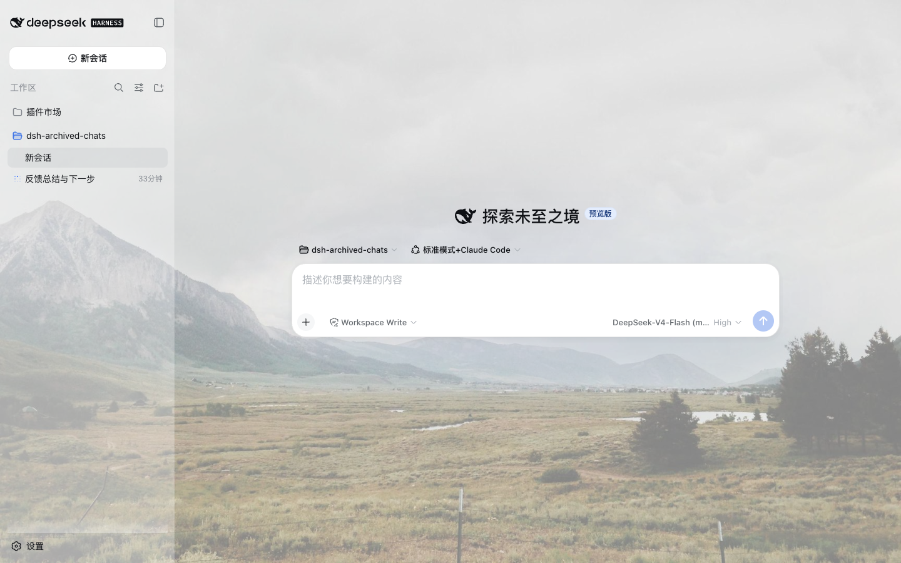
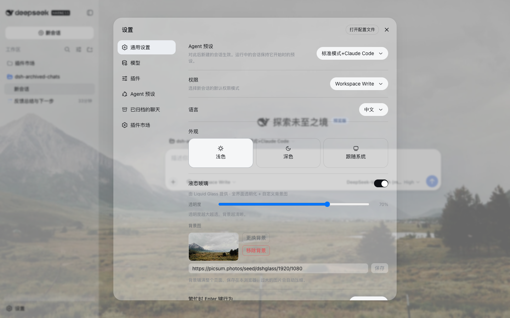

# dsh-liquid-glass

[English](README.md) | 中文

[](https://www.npmjs.com/package/dsh-liquid-glass)
[](LICENSE)
[](https://github.com/deepseek-ai/deepseek-harness)

**[DeepSeek Harness](https://github.com/deepseek-ai/deepseek-harness) 的液态玻璃**——点一下，整个界面通透起来。

为 DeepSeek Harness 而生的透明质感：页面底层、卡片、面板、聊天气泡全部化为半透玻璃，衬上你选的背景图。透明度一个滑块随心调，背景图想换就换。除此之外什么都没有——好用的东西，本就该这么简单。

## 安装

```sh
dsh plugin --profile web add dsh-liquid-glass
```

打开 **设置 → 通用**，出现「液态玻璃」设置行。默认开启；装完重启一次。

## 效果预览

| 设置 | 玻璃界面 | 自定义壁纸 |
| --- | --- | --- |
|  |  |  |

## 功能

- **全界面透明化**：页面底层、卡片、面板、侧栏、聊天气泡、代码块——所有表面经官方 ThemeRuntime token 覆盖层变成半透明。亮色方案用中性白，暗色用近黑。
- **一个透明度主滑块**（3%–95%）：越大越透，背景越清晰。
- **全页自定义背景**：本地上传（自动压缩）或粘贴 URL，铺满整个页面，衬在玻璃之下。

## 隐私与兼容性

- 设置和上传的背景仅保存在当前浏览器的 `localStorage` 中；插件没有服务端组件，也不发送遥测数据。
- 界面仅通过 DeepSeek Harness 的公开客户端运行时、语言、插槽和主题 API 集成。
- 支持亮色和暗色方案。安装后需要重启一次 DSH，以便加载客户端 bundle。

## 从源码验证

冒烟测试会在模拟的 DSH 浏览器运行时中执行实际发布的客户端 bundle，覆盖注册、生命周期、设置、持久化、壁纸控制和滑块边界：

```sh
node test/smoke.test.mjs
```

## 卸载

```sh
dsh plugin --profile web remove dsh-liquid-glass
```

偏好保存在本浏览器 localStorage，卸载后无害残留。

## 许可证

MIT
